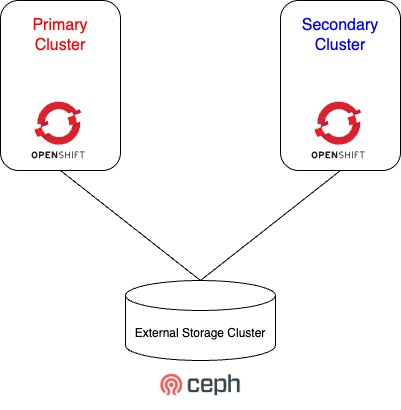
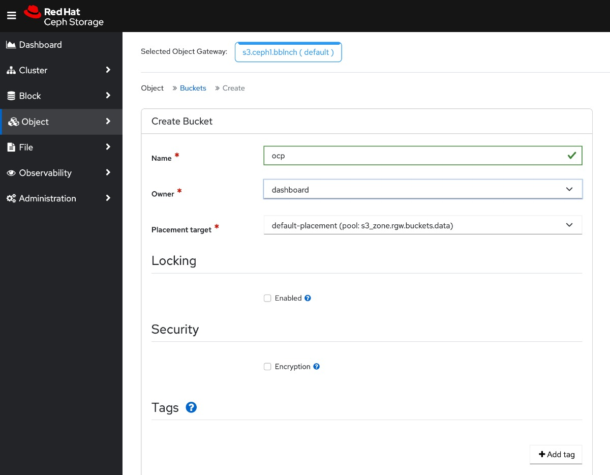
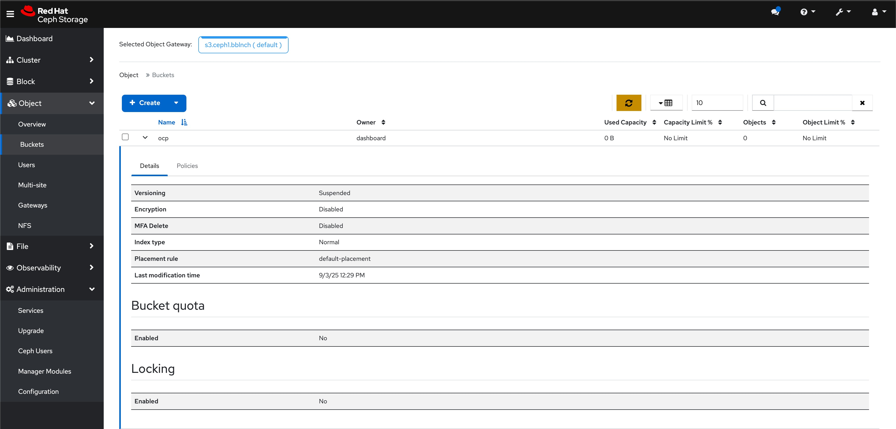
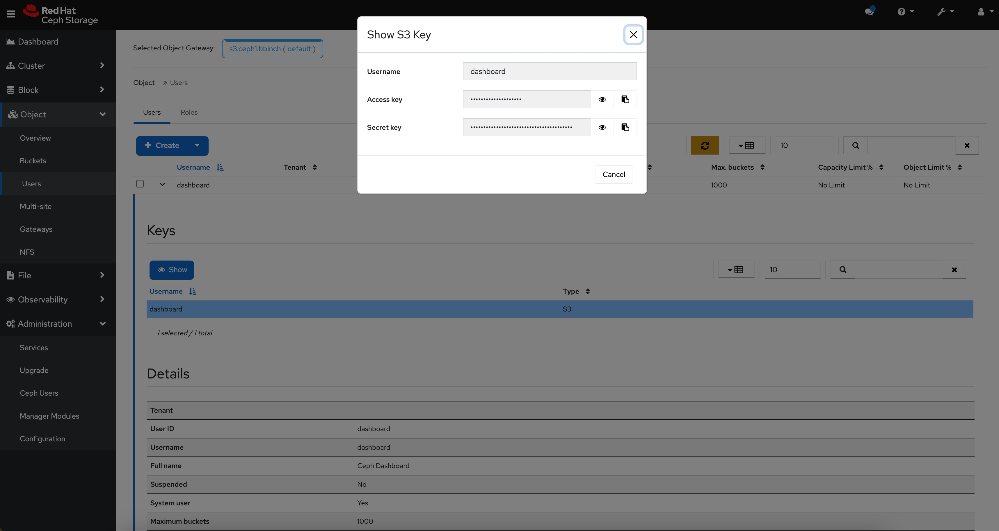

## Background

This demo looks at how we can connect 2 OpenShift clusters to an external Ceph storage cluster and make use of OADP (OpenShift API for Data Protection) to backup stateful workloads in the primary cluster and restore it in the secondary cluster.

The demo video on MS-SQL container workload backup and restore from Primary to Secondary Cluster can be found at the following [link](https://youtu.be/6GA1DRNq604)

The demo video on Windows 2019 Server VM ([OpenShift Virtualization](https://www.redhat.com/en/technologies/cloud-computing/openshift/virtualization)) backup and restore from Primary to Secondary Cluster can be found at the following [link](https://youtu.be/Drhj99-EpRc)

## Setting up the Environment
- A high level architecture of the deployment is as follows:

  

- We will need to first install the OADP Operator using the OpenShift Console

  1. In the OpenShift Container Platform web console, click Operators → OperatorHub.
  2. Use the Filter by keyword field to find the OADP Operator.
  3. Select the OADP Operator (select the one from Red Hat source, instead of the Community source) and click Install.
  4. Accept default values and click Install to install the Operator in the openshift-adp project.
  5. Click Operators → Installed Operators to verify the installation.


- Once the OADP Operator is installed, we will proceed to create the required object storage in the CEPH cluster





- The credentials, in this case, will be that of the `dashboard` user, which can be retrieved under the user tab




- With these information, we will be able to create the secret in the OpenShift cluster that will be used to authenticate with the object storage. In this case, we will create a YAML file, i.e. `credentials-velero` that looks like this:

```
[default]
aws_access_key_id=changemeAccessKey
aws_secret_access_key=changemeSecretAccessKey
```

- And we will create the secret using the following command

```
oc create secret generic cloud-credentials -n openshift-adp --from-file cloud=credentials-velero
```

- And create the `DataProtectionApplication` file

```
---
apiVersion: oadp.openshift.io/v1alpha1
kind: DataProtectionApplication
metadata:
  name: openshift-dpa
  namespace: openshift-adp
spec:
  backupLocations:
    - velero:
        config:
          insecureSkipTLSVerify: 'true'
          profile: default
          region: changeme
          s3ForcePathStyle: 'true'
          s3Url: 'http://changeme.example.com:8000'
        credential:
          key: cloud
          name: cloud-credentials
        default: true
        objectStorage:
          bucket: ocp
          prefix: ocpcluster1
        provider: aws
  configuration:
    nodeAgent:
      enable: true
      uploaderType: kopia
    velero:
      defaultPlugins:
        - kubevirt
        - aws
        - csi
        - openshift
      defaultSnapshotMoveData: true
      defaultVolumesToFSBackup: false
      featureFlags:
        - EnableCSI
      resourceTimeout: 10m
```

- The same configurations will be configured on both the primary and secondary clusters. The object storage bucket will be visible to both the clusters in this case and the content that is backed up from the primary cluster to the bucket can then be used to restore the stateful workload in the secondary cluster.


## Deploy Sample Stateful Application

- The stateful application that we will be using in this demo will be mssql. Its associated YAML definitions can be found in the `mssql.yaml` in this repo. Note that the `storageClassName` will need to be updated accordingly. In our case, we are using `ocs-external-storagecluster-ceph-rbd`.

- We will deploy the stateful application in the primary cluster:

```
oc apply -f mssql.yaml
```


## Backup Application in Primary Cluster

- Create `Backup` resource file in the Primary Cluster. The backup will be retained for 30 days (720 hours).

```
---
apiVersion: velero.io/v1
kind: Backup
metadata:
  name: mssql-backup
  namespace: openshift-adp
spec:
  csiSnapshotTimeout: 10m0s
  defaultVolumesToFsBackup: false
  itemOperationTimeout: 4h0m0s
  snapshotMoveData: true
  includedNamespaces:
  - mssql-persistent-app
  storageLocation: openshift-dpa-1
  ttl: 720h0m0s
```

## Restore Application in Secondary Cluster

- Create `Restore` resource file in the Secondary Cluster.

```
---
apiVersion: velero.io/v1
kind: Restore
metadata:
  name: mssql-restore
  namespace: openshift-adp
spec:
  backupName: mssql-backup
```

## Conclusion

- OADP, together with external object storage bucket and software defined storage solutions such as external CEPH storage, can be used to backup a stateful application in primary cluster and restored in a secondary cluster
- OADP is also able to backup OpenShift cluster wide attributes such as **Security Context Constraints** (SCC) and hence is useful for Enterprises who have been running stateless applications in OpenShift for years and looking to adopt stateful workload, as it gives them the confidence that they can restore the configurations that have been applied to an existing cluster to another fresh new cluster, in the event of a disaster event. This is especially crucial for Enterprises which are running mainly COTS applications where they might not have full visbility or knowledge of all the parameters and configurations that the ISV vendors have configured over time. While GitOps is the way around this, it is not always practised in all parts of a large organization.
